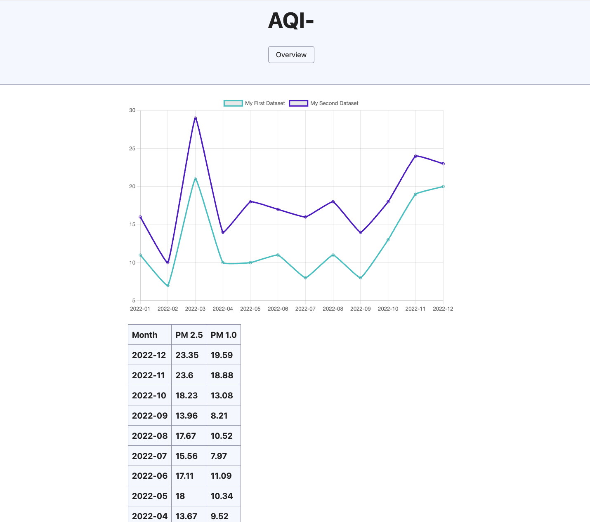

# AQI Explorer

AQI Explorer is a simple web-based application that allows users to view and analyze air quality data through graphs and tables. The project uses PHP for backend data handling and JavaScript for displaying graphs and dynamic updates.

## Features
- View Air Quality Index (AQI) data for different pollutants such as PM2.5 and PM10.
- Graphical representation of AQI data for easy analysis.
- Interactive interface to explore AQI trends over time.
- Real-time updates using PHP and JavaScript.

## Technologies Used
- **PHP**: Backend for fetching, processing, and serving AQI data.
- **JavaScript**: Used for rendering graphs and dynamic interactions on the front end.
- **HTML/CSS**: For the user interface.
- **Chart.js**: (or any other charting library you used) For visualizing the AQI data in graphs.

## Installation

1. Clone the repository:
    ```bash
    git clone [https://github.com/your-username/aqi-explorer.git](https://github.com/smmahadee/aqi-project.git)
    ```
   
2. Navigate to the project directory:
    ```bash
    cd aqi-explorer
    ```

3. Set up a local development server using **Herd**, **XAMPP**, or **WAMP** (or any PHP server of your choice):
    ```bash
    herd start
    ```

4. Ensure your PHP server is running, and open your browser to access the project at `http://localhost` (or the appropriate server URL).

## Usage

1. Visit the homepage to view the AQI dashboard.
2. Select a city or region to see AQI data.
3. Explore data trends through interactive graphs.
4. Switch between different pollutants (e.g., PM2.5, PM10) to analyze their impact on air quality.
5. Download the AQI data as needed (optional feature if you have implemented it).

## Screenshots
Add screenshots of the graph and data visualization here to give users a preview of your project.




## Contact
For any questions or feedback, please reach out to me at [mahadee.codes@gmail.com].
